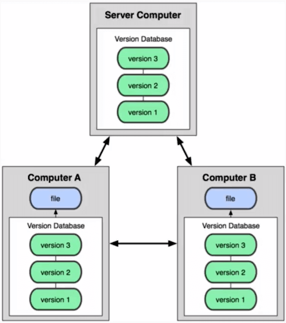
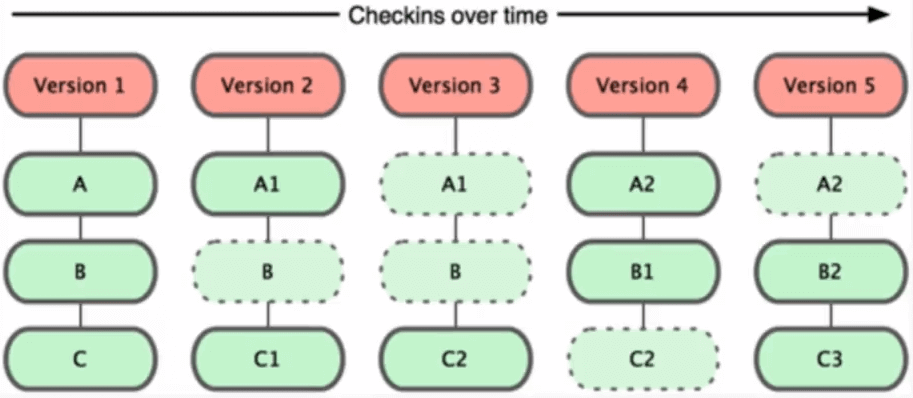
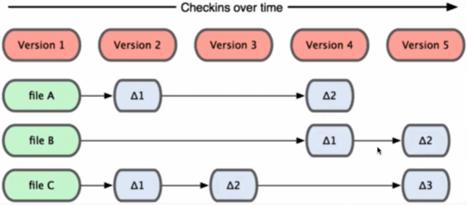

# Curso Profecional de GIT y GITHUB

### Tabla de contenido
- [Que es GIT? "sistema de control de versiones"](#sistema-de-control-de-versiones)
  - [Tipos de sistemas de control](#tipos-de-sistemas-de-control)
- [Beneficios de Git](#beneficios-de-git)
- [Fundamentos de Git](#fundamentos-de-git)
- [Los 3 estados de Git](#los-3-estados-de-git)
- [Github](#github)
- [Configurar Git](#configurar-git)
- [Comandos basicos en Git](#Comandos-basicos-en-git) 
- [Flujo de trabajo en Git](#flujo-de-trabajo-en-git)
- [Trabajando con repositorios remotos en GitHub](#Trabajando-con-repositorios-remotos-en-GitHub) 
- [Ignorar archivos](#Ignorar-archivos) 


## Sistema de control de versiones

Un sistema que registra los cambios realizados sobre un archivo o conjunto de archivos a lo largo del tiempo. Este tipo de sistemas nos permiten volver en el tiempo y salvar nuestro trabajo.

<div align ="right">
  <small><a href="#tabla-de-contenido">🡡 volver al inicio</a></small>
</div>

## Tipos de sistemas de control

`Local Computer` Solo vive en nuestro computador.

<div align="center">
  
  <small><p>Sistema de Control Local</p></small>
</div>

`Centralizado` No depende únicamente de un computador en el que se trabaja, sino que depende del súper servidor en donde se almacena la información. El servidor provee las copias a sus hijos, pero solo guarda los cambios en un solo lugar.

<div align="center">
  
  <small><p>Sistema de Control Centralizado</p></small>
</div>

`Sistema de control distribuidos` Cada uno de los que participan en el proyecto, tienen copia del proyecto que se realiza, por eso no dependemos de un solo computador que almacene toda la información.

<div align="center">
  
  <small><p>Sistema de Control Distribuido</p></small>
</div>

Git es un Sistema de Control de Versiones Distribuido.

Git fue creado por Linus Torvals

<div align="right">
  <small><a href="#tabla-de-contenido">🡡 volver al inicio</a></small>
</div>

## Beneficios de Git

* `Velocidad` Puedes trabajar fluidamente desde tu computador.
* `Diseño sencillo` El codigo es robusto con las herramientas necesarias, como viajar en el tiempo.
* `Fuerte apoyo en el desarrollo no lineal` No trabaja de manera lineal, la linea del tiempo tiene bifurcaciones de manera independiente al proyecto principal.
* `Completamente distribuido` Cada quien puede tener una copia del proyecto.
* `Capaz de manejar grandes proyectos` Linux, Django, Laravel, etc. Usan git.

<div align="right">
  <small><a href="#tabla-de-contenido">🡡 volver al inicio</a></small>
</div>

## Fundamentos de Git

* Git almacena una referencia a todos los archivos que no se han cambiado
* Casi cualquier operación en Git es local. Se puede trabajar offline
* Git tiene integridad. No puedes perder información durante su transmisión o sufrir corrupción de archivos sin que Git lo detecte

<div align="center">
  
  <small><p>Almacenamiento de Archivos en GIT</p></small>
</div>

<div align="center">
  
  <small><p>Almacenamiento de Archivos en Subversion</p></small>
</div>

<div align="right">
  <small><a href="#tabla-de-contenido">🡡 volver al inicio</a></small>
</div>

## Los 3 estados de Git

* `Working Directory` Es donde trabajamos de manera local, pero para guardarlo hay que pasarlo al Staging Area
* `Staging Area` Es el área de preparación, se almacenan justo antes de hacer commit
* `Git repository` El repositorio donde almacenaremos los cambios del proyecto

<div align="center">
  
  <small><p>Estados de Git</p></small>
</div>

<div align="right">
  <small><a href="#tabla-de-contenido">🡡 volver al inicio</a></small>
</div>

## Github

`GitHub` es una plataforma en la que se almacenan los cambios de un proyecto. Además es una plataforma que funciona como una red social. Aquí, las personas que visiten tu sitio puedan darle estrellitas a los proyectos que hayas desarrollado. 

https://github.com/


`Git` es el software que ayuda con el versionado y Github es la red social que nos va a ayudar a distribuir el software.

<div align="right">
  <small><a href="#tabla-de-contenido">🡡 volver al inicio</a></small>
</div>


## Configurar Git


Ver configuracion de git: 
```bash
	git config --list
```

ver donde se guardan las configuraciones:
```bash
	git config --list --show-origin
```

Cambiar nombre de usuario:
```bash
	git config --global user.name "<nombreUsuario>"
```

Cambiar Email:
```bash
	git config --global user.email "<emailUsuario>"
```

<div align="right">
  <small><a href="#tabla-de-contenido">🡡 volver al inicio</a></small>
</div>


## Comandos basicos en Git

iniciar un repositorio de git:
```bash
	git init
```

ver estado de archivos:
```bash
	git status
        * `untracked files` son archivos que están en nuestro Working Directory, lo que aparezca en rojo es lo que se ha modificado y hay que pasarlo al Staging.
        * `changes to be comitted` son los archivos que se encuentran en el staging area. Aparecen en 
```

Agregar archivos a staging area:
```bash
	git add <nombreArchivo>
        * `-A` agrega todos los archivos del working directory al staging area. git add . hace lo mismo.
        * `-n`[archivo] simula el agregado de un [archivo].
```

agregar todos los archivos a stagin area:
```bash
	git add .
```

sacar archivos de staging area: 
```bash
	git rm --cached <archivo>
```

enviar archivos de staging area a repositoryo: 
```bash
	git commit -m "<mensajeCommit>"
```

agregar y enviar archivos a staging y hacer comit a repo:
```bash
	git commit -am "<mensajecommit>"
```

ver Historial de commit:
```bash
	git log <nombreArchivo>
        * `--oneline` resumido.
        * `--graph` ver las ramificaciones.
        * `-[numero]` ver los ultimos [numero] commits.
```

ver cambios:
```bash
	git show <nombreArchivo>
```

ver cambios entre commit:
```bash
	git diff <codigoCommit1> <codigoCommit2>
```

volver a un commit anterior: 
```bash
	git reset <codigoCommit> --hard
```

traer archivos de comit anteriores 
```bash
	git checkout <codigoCommit> <nombreArchivo> 
```

traer archivo mas actual 
```bash
	git checkout master <nombreArchivo>
```

<div align="right">
  <small><a href="#tabla-de-contenido">🡡 volver al inicio</a></small>
</div>

## Flujo de trabajo en Git


crear nueva rama 
```bash
	git branch <nombreRama>
```

moverme entre ramas 
```bash
	git checkout <nombreRama>
```

fusionar ramas 
```bash
	git merge <nombreRama>
```


<div align="right">
  <small><a href="#tabla-de-contenido">🡡 volver al inicio</a></small>
</div>

## Trabajando con repositorios remotos en GitHub


Agregar ruta de repositorio remoto en https
```bash
	git remote add origin <URL>
```

ver rutas remotas 
```bash
	git remote 
	git remote -v
```

forzar traer archivos a repositorio local 
```bash
	git pull origin <rama> --allow-unrelated-histories
```

traer archivos a repositorio local 
```bash
	git pull origin <rama>
```

enviar archivos a repositorio de github
```bash
	git push origin <rama>
```

crear un tag y asignarlo a un commit
```bash
	git tag -a <nombreTag> -m "" <commit>
```

ver tags 
```bash
	git tag
	git show-ref --tags
```

enviar tag a github
```bash
	git push origin --tags
```

eliminar tag 
```bash
	git tag -d <nombreTag>
	git push origin :refs/tags/<nombreTag>
```

ver ramas totales 
```bash
	git show-branch --all
```
 
clonar repositorio de github
```bash
	git clone <url>
```
<div align="right">
  <small><a href="#tabla-de-contenido">🡡 volver al inicio</a></small>
</div>


## Ignorar archivos

Para ignorar archivos o carpetas de los commits se crea un archivo que se llame `.gitignore`.

Página que crear .gitignore para los proyectos:
https://www.gitignore.io/

<div align="right">
  <small><a href="#tabla-de-contenido">🡡 volver al inicio</a></small>
</div>

## resumen de comandos

* `git init [nombre]` inicia un repositorio y crea la carpeta [nombre].
* `git status` muestra el estado de los archivos en el repositorio.
  * `untracked files` son archivos que están en nuestro Working Directory, lo que aparezca en rojo es lo que se ha modificado y hay que pasarlo al Staging.
  * `changes to be comitted` son los archivos que se encuentran en el staging area. Aparecen en verde.
* `git add [archivo]` agrega un archivo al staging
* `git add -A` agrega todos los archivos del working directory al staging area. `git add .` hace lo mismo.
 * `git add -n [archivo]` simula el agregado de un [archivo].
* `git rm --cached [archivo]` quita un [archivo] del staging al working area.
* `git rm -f` quita el archivo del staging y del working directory.
* `git commit -m ["mensaje"]` agrega los archivos del staging al repositorio.
* `git commit --amend` anexa el nuevo cambio al anterior commit. Si se escribe un mensaje este sobreescribe el anterior.
* `git tag -a [tag] -m ["comentario"]` agrega el tag con un comentario al ultimo commit.
* `git tag -l` lista los tags.
* `git tag [tag] [sha1 del commit]` agrega un tag a un commit en partcular.
* `git tag -d [tag]` elimina el tag.
* `git tag -f -a [nuevo tag] [sha1 del commit]` renombra el tag del commit pero deja el anterior tag.
* `git log` ver la lista de commits.
  * `--oneline` resumido.
  * `--graph` ver las ramificaciones.
  * `-[numero]` ver los ultimos [numero] commits.
* `git diff [sha1 del commit]` muestra la diferencias del commit [sha1].
* `git diff [sha1-1] [sha1-2]` diferencia entre la version 1 vs la version 2.
* `git reset`
  * `--soft [sha1]` borrar todos los commits posteriores a [sha1]. Los archivos que salen del repositorio son pasados al staging area.
  * `--mixed [sha1]` borrar todos los commits posteriores a [sha1]. Los archivos que salen del repositorio son pasados al working directory
  * `--hard [sha1]` elimina todos los cambios incluso del working directory. 
* `git branch [nombre]` crear la rama [nombre]
* `git branch -l` lista las ramas
* `git branch -d [nombre]` elimina el branch [nombre]. Esto solo funciona si el branch no tiene ningún commit.
* `git branch -D [nombre]` fuerza la eliminación de un branch sin importar si tiene commits
* `git branch -m [nombre inicial] [nuevo nombre] ` renombra el branch [nombre inicial] por [nuevo nombre]
* `git checkout [brach]` moverse al branch [branch]
* `git chechout [sha1]` ir al momento del tiempo de ese commit
* `git checkout -b [nombre]` crea un branch y se mueva al mismo
* `git checkout -- [archivo]` descarta todos los cambios del archivo
* `git merge [branch]` mezcla el branch [branch] con el branch actual
* `git rebase [branch]` mezcla el branch con el brach actual. Es como el merge pero sin crear bifurcaciones
* `git stash` es un limbo como el staging area. Te permite cambiar de branch sin hacer commit
* `git stash list` ver la lista de los stash
* `git stash drop stash@{numero}` elimina el stash 
* `git stash apply stash@{numero}` aplica el stash
* `git cherry pick [sha1]` mover el commit [sha1] de otro branch al branch actua
* `git clone [ruta]` trae el repositorio a la computadora
* `fork` hace una copia de un repositorio externo a nuestra cuenta
* `ssh-keygen -t rsa -b 4096 -C "correo@ejemploc.com"` crea una llave ssh. El correo debe de ser el mismo que se encuentra en Github
* `git remote add [nombre] [ruta]` conecta un repositorio remoto con uno local. Por defecto el nombre es origin
* `git remote -v` lista las conexiones remota
* `git remote remove [nombre]` remueve una conexión remota
* `git fetch [nombre] [branch]` traer . Solo los trae pero no lo mezcla
* `git merge [origin/master] --allow-unrelated-histories` hace un merge del fetch con el repositorio local
* `git pull [origin] [branch]` hace un fetch mas merge
* `git push [origin] [master]` envia al repositorio local al remoto
  * `--tags` enviar los tags
* `git push --all origin` push a todos los branch y tags

