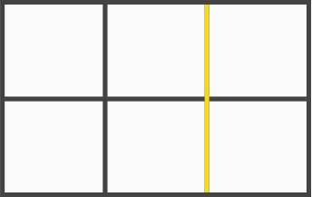
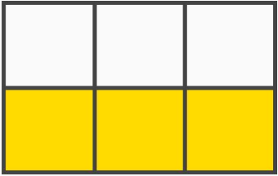
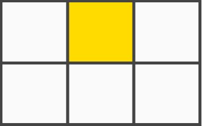
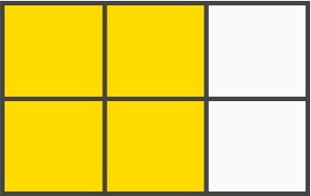

# CSS Grid Layout
### Tabla de contenido
- [Conceptos fundamentales sobre CSS Grid Layout](#Conceptos-fundamentales-sobre-CSS-Grid-Layout)
- [Definiendo columnas ](#Definiendo-columnas)
- [Definiendo filas](#Definiendo-filas)
- [Definiendo filas y columnas](#Definiendo-filas-y-columnas)
- [grid explicito e implicito ](#grid-explicito-e-implicito)
- [Grid identados y tipos de display](#Grid-identados-y-tipos-de-display)
- [Espaciado entre filas y columnas ](#Espaciado-entre-filas-y-columnas)
- [Repetidores, unidades de medida y funciones](#Repetidores-unidades-de-medida-y-funciones)
- [Definiendo áreas de contenido](#Definiendo-áreas-de-contenido)
- [Definiendo el tamaño de las columnas dentro de un grid](#Definiendo-el-tamaño-de-las-columnas-dentro-de-un-grid)
- [Definiendo el tamaño de filas dentro de un grid](#Definiendo-el-tamaño-de-filas-dentro-de-un-grid)
- [Definiendo el nombre de lineas](#Definiendo-el-nombre-de-lineas)
- [Manejando el grid implícito](#Manejando-el-grid-implícito)
- [Alineación de contenido](#Alineación-de-contenido)
- [Alineación de filas y columnas](#Alineación-de-filas-y-columnas)

### Conceptos fundamentales sobre CSS Grid Layout
ideal para layout dinamicos 

- Grid container elemento padre donde se asigna un { display: grid;}

- Grid item Hijos directos de un grid container 

```
<div class="container">
  <div class="item item1"></div>
  <div class="item item2"></div>
  <div class="item item3"></div>
</div>

```

- **Grid line: lineas divisoras horizontales o verticales**
<div align="center">
  
  <small><p>Grid Line</p></small>
</div>


- **Grid track: estacios entre dos lineas adyacentes, FILAS Y COLUMNAS**
<div align="center">
  
  <small><p>Grid Track</p></small>
</div>

- **Grid cell: espacio en dos filas adyacentes y 2 columnas dayacentes**
<div align="center">
  
  <small><p>Grid Cell</p></small>
</div>

- **Grid area: espacio rodeado por 4 grid lines**
<div align="center">
  
  <small><p>Grid Area</p></small>
</div>

<div align ="right">
  <small><a href="#tabla-de-contenido">🡡 volver al inicio</a></small>
</div>

### Definiendo columnas 

```
.container {
	display: grid;
	grid-template-columns: 25% 1fr 200px;
}
```
<div align ="right">
  <small><a href="#tabla-de-contenido">🡡 volver al inicio</a></small>
</div>

### Definiendo filas

```
.container {
	display: grid;
	grid-template-rows: 25% 1fr 200px;
}
```
<div align ="right">
  <small><a href="#tabla-de-contenido">🡡 volver al inicio</a></small>
</div>

### Definiendo filas y columnas

```
.container {
	display: grid;
	grid-template: 25% 1fr 200px / 1fr 30px 10%;
}
```

<div align ="right">
  <small><a href="#tabla-de-contenido">🡡 volver al inicio</a></small>
</div>

### grid explicito e implicito 
- explicito Elementos definidos 
- implicito elementos no definidos 


<div align ="right">
  <small><a href="#tabla-de-contenido">🡡 volver al inicio</a></small>
</div>

### Grid identados y tipos de display
podemos crear grids container dentro de otros grids container


```
.item:nth-of-type(4) {
	display: grid;
	grid-template: 25% 1fr 200px / 1fr 30px 10%;
}
```
<div align ="right">
  <small><a href="#tabla-de-contenido">🡡 volver al inicio</a></small>
</div>

### Espaciado entre filas y columnas 

```
.item:nth-of-type(4) {
	display: grid;
	grid-column-gap: 30px;
	grid-row-gap: 30px;
	grid-gap: 30px 20px;
}
```
<div align ="right">
  <small><a href="#tabla-de-contenido">🡡 volver al inicio</a></small>
</div>

### Repetidores unidades de medida y funciones

- las fracciones se representan con `fr` y son distintas a `auto`

funciones 
- podemos repetir codigo con  `repeat(4, 1fr)`
- podemos controlar las dimensiones minimas y maximas de filas y columnas con  `repeat(4, minmax(200px, 1fr));

<div align ="right">
  <small><a href="#tabla-de-contenido">🡡 volver al inicio</a></small>
</div>

### Definiendo áreas de contenido

- se definen las filas y columnas en el grid container
- se definen las areas en el grid container 
- se crean clases y se asignan areas a los grid hijos 

```
.container {
	display: grid;
	grid-template: 100px 1fr 100px/ 200px 1fr;
	grid-template-areas: 	"header header"
				"left contenido"
				"footer footer";
}

.header {
	grid-area: header;
}

.left {
	grid-area: left;
}

.contenido {
	grid-area: contenido;
}

.footer {
	grid-area: footer;
}


```
<div align ="right">
  <small><a href="#tabla-de-contenido">🡡 volver al inicio</a></small>
</div>


### Definiendo el tamaño de las columnas dentro de un grid

- se asigna el tamaño en los grid hijos
- el tamaño se asigna a las lineas de inicio y termino

```
.item1 {
	grid-column-start: 1;
	grid-column-end: 3;
}

.item2 {
	grid-column: 2 / 4;
}

.item3 {
	grid-column: 2 / span 2;
}
```
<div align ="right">
  <small><a href="#tabla-de-contenido">🡡 volver al inicio</a></small>
</div>

### Definiendo el tamaño de filas dentro de un grid


- se asigna el tamaño en los grid hijos
- el tamaño se asigna a las lineas de inicio y termino

```
.item1 {
	grid-row-start: 1;
	grid-row-end: 3;
}

.item2 {
	grid-row: 2 / 4;
}

.item3 {
	grid-row: 2 / span 2;
}
```
<div align ="right">
  <small><a href="#tabla-de-contenido">🡡 volver al inicio</a></small>
</div>


### Definiendo el nombre de lineas

```
.container {
	display: grid;
	grid-template-columns: [inicio]1fr 1fr 1fr 1fr 1fr[final]
	grid-template-rows: [inicio]200px 300px[final]
}

item {
	grid-column: inicio / final;
	grid-row: inicio / final;
}
```

<div align ="right">
  <small><a href="#tabla-de-contenido">🡡 volver al inicio</a></small>
</div>

### Manejando el grid implícito

- por defecto nuestro grid implicito acomula los elementos en filas 
```
.container {
	display: grid;
	grid-auto-flow:column;
	grid-auto-columns: 200px 1fr;
	grid-auto-rows: 1fr 1fr;
}

```
<div align ="right">
  <small><a href="#tabla-de-contenido">🡡 volver al inicio</a></small>
</div>

### Alineación de contenido
alineando items en el grid container

justifi-items: para grid container
justifi-self: para items

- start
- end
- center
-stretch

aling-items: para grid container
aling-self: para items
- start
- end
- center
-stretch
 

```
.container {
	display: grid;
	justify-items: start;
	aling-items: start;
}

```
<div align ="right">
  <small><a href="#tabla-de-contenido">🡡 volver al inicio</a></small>
</div>


### Alineación de filas y columnas
justify-content
- start
- end
- center
- stretch
- space-around
- space-between
- space-evenly

aling-content
- start
- end
- center
- stretch
- space-around
- space-between
- space-evenly

<div align ="right">
  <small><a href="#tabla-de-contenido">🡡 volver al inicio</a></small>
</div>