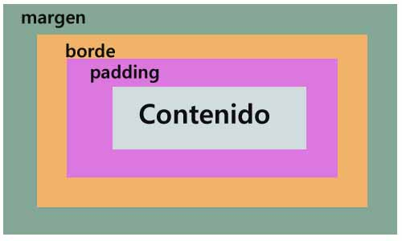

# Curso html 

### Tabla de contenido
- [Etiquetas](#Etiquetas)
- [Estructura de nuestro Sitio Web](#Estructura-de-nuestro-Sitio-Web)
- [Continuando con la estructura de nuestro Sitio Web](#Continuando-con-la-estructura-de-nuestro-Sitio-Web)
- [Atributos HTML](#Atributos-HTML)
- [Formularios HTML](#Formularios-HTML)
- [Formas de agregar estilos a HTML](#Formas-de-agregar-estilos-a-HTML)
- [Los estilos incluidos por el navegador](#Los-estilos-incluidos-por-el-navegador)
- [Agregando clases a los componentes escritos en HTML](#Agregando-clases-a-los-componentes-escritos-en-HTML) 
- [Unidades de medida y colores](#Unidades-de-medida-y-colores)
- [Tipos de textos personalizados](#Tipos-de-textos-personalizados) 
- [Propiedades para los textos](#Propiedades-para-los-textos) 
- [Dimensiones fijas para elementos](#Dimensiones-fijas-para-elementos) 
- [Backgrounds de color e imagen](#Backgrounds-de-color-e-imagen)
- [Bordes](#Bordes)
- [Margenes](#Margenes)
- [Rellenos](#Rellenos)
- [Modelo de caja](#Modelo-de-caja)
- [Tipos de display](#Tipos-de-display)

- [Propiedades de flexbox](#Propiedades-de-flexbox)
- [Alineando elementos de forma horizontal](#Alineando-elementos-de-forma-horizontal)
- [Alineando elementos de forma vertical](#Alineando-elementos-de-forma-vertical)

### Etiquetas
Las etiquetas son la representacion basica de la informacion en un documento html. Sirven para crear y organizar el contenido.

La sintaxis general de una etiqueta es:

```bash
<nombre> contenido nombre>
Hay ciertas etiquetas que tienen una sintaxis diferente, ya que se cierran en si mismas; es decir, no tienen etiqueta de cierre:

<nombre />
```

#### Algunas de las etiquetas mis conocidas y usadas son:

<b>Etiquetas de cabecera (head):</b>
- doctype: indica al navegador el tipo de documento que se este mostrando.
- html: es la etiqueta que envuelve todo el documento
- head: es la cabecera del documento y contiene sub etiquetas que describen al documento o incluyen recursos adicionales.

<b>Etiquetas del cuerpo del documento (body):</b>
- article: diferencia partes del contenido que pueden vivir por si mismas.
- nav: para hacer menos de navegacion.
- aside: contenido menos relevante, como publicidad, etc.
- section: sirve para diferenciar las secciones principales del contenido.
- header: cabecera del documento.
- footer: pie de pagina del documento.
- h1 - h6: titulos de nuestro sitio web.
- table: tablas de contenidos, similar a la estructura de las hojas de calculo.
- ul y ol: listas de items.
- div: cualquier division para organizar el contenido.

<div align ="right">
  <small><a href="#tabla-de-contenido">🡡 volver al inicio</a></small>
</div>

### Estructura de nuestro Sitio Web

El proyecto que desarrollaremos en este curso se trata de un Portafolio Personal, incluira una cabecera, navegacion, un hero (area visual con informacion destacada), un area de proyectos y otra para eventos, y finalmente un pie de pagina con un formulario de contacto y enlaces a redes sociales.

El archivo index.html es el archivo que el navegador abre por defecto al acceder a un directorio en un servidor web.

La estructura basica de un archivo html es la siguiente:

```bash
<html>
  <head>
    <title> Titulo de la pagina title>
  head>
  <body>
    <header> Cabecera del contenido header>
    <section> Seccion principal section>
    <section> Otra seccion section>
    <footer> Pie de pagina del documento footer>
  body>
html>
```
<div align ="right">
  <small><a href="#tabla-de-contenido">🡡 volver al inicio</a></small>
</div>

### Continuando con la estructura de nuestro Sitio Web
La estructura html de nuestro proyecto usa una o mes de las siguientes etiquetas:

- h1 a h6: son etiquetas para indicar titulos con un estilo que destaca del resto.
- article: es la parte de nuestro contenido que puede vivir por si mismo. Pueden haber tantos article como proyectos o eventos tenga nuestro portafolio.
- p: define el texto de un parrafo.
- small: aplica una apariencia de texto reducido en tamaño.
- strong: aplica al texto un formato de negritas.
- a: corresponde a un ancla o enlace a una url interna o externa del documento.
- img: con esta etiqueta podemos enlazar imagenes en el documento.
- figure: le da un contexto semantico a las imagenes.

<div align ="right">
  <small><a href="#tabla-de-contenido">🡡 volver al inicio</a></small>
</div>

### Atributos HTML

Los atributos son valores agregados a las etiquetas (tags) html que extienden su habilidad o funcionalidad con información específica.

A continuación, un ejemplo de los atributos más comunes y usados en algunas etiquetas:

Para `img` :
- src: específica la ruta de la imagen que será mostrada a través de esta etiqueta. La ruta puede ser absoluta (cunado especifica una dirección exacta, incluyendo el prefijo http(s) ) o relativa (cuando la referencia a la ubicación de la imagen parte de la ubicación del archivo actual).
- alt: indica un texto alternativo que será mostrado en lugar de la imagen cuando ésta no pueda ser mostrada.
- width: ancho de la imagen en pixeles.
- height: alto de la imagen en pixeles.

Para `link`, en la cabecera head del documento:
- rel: indica la relación del recurso con el contenido.
- type: indica el tipo de recurso / formato.
- href: indica la ubicación (url) del recurso enlazado.

Para `meta`, ambién en la cabecera head del documento:
- charset: indica la tabla de caracteres (utf-8 para caracteres latinos) usada en el documento.

Para `a`:
- href: la ubicación o ruta a la que enlaza esta etiqueta de ancla. En el caso de querer enlazar a elementos que se encuentran dentro del mismo documento, este atributo debe indicar el valor del atributo ““id”” de ese elemento destino del enlace.

<div align ="right">
  <small><a href="#tabla-de-contenido">🡡 volver al inicio</a></small>
</div>

### Formularios HTML
Los Formularios en html son unidades de información que nos permiten recolectar información para enviarlos al propietario del website o a un servicio externo. Esta formado por dos partes o contextos: una parte donde se hace el ingreso y modelación de esos datos (en el frontend), y otra parte que se encarga de enviar, procesar y almacenar esos datos (en el backend).

Los formularios se crean con la etiqueta `form`. El atributo principal de un formulario es action, ya que contiene la ruta a la que serán enviados los datos recolectados.

Hay diversos elementos html que permiten la captura o recolección de datos, aunque generalmente se usan los elementos creados con la etiqueta input. Los inputs también sirven para crear botones, aunque existe una etiqueta especial para ésto llamada button… El atributo principal de los inputs es type, que indica el tipo de comportamiento o dato que se espera recibir.

Los elementos creados con la etiqueta label muestran un texto que se puede asociar con un input para darle mayor significado al campo, principalmente cuando no se usa el atributo placeholder.

<div align ="right">
  <small><a href="#tabla-de-contenido">🡡 volver al inicio</a></small>
</div>

### Formas de agregar estilos a HTML
Hay tres opciones para incluir estilos que definan la apariencia de tu html:

- Estilos en línea: se definen directamente en el elemento html que quieres estilizar, se agregan con el atributo style.
- Estilos con el tag Style: regularmente este tag se incluye dentro de la etiqueta head del html.
- Estilos enlazados desde un archivo css externo: utilizando la etiqueta link que nos permite enlazar recursos externos.

A CSS, se le llama hojas de estilos en cascada porque los estilos que se definen para una página, se van aplicando de arriba hacia abajo, y de lo más general a lo más particular, teniendo prioridad lo más particular. Esto es, los estilos que prevalecen son los que han sido definidos en línea, luego los que fueron definidos mediante la etiqueta style en la cabeza o cuerpo del html, y por último los estilos definidos en archivos externos enlazados con la etiqueta link. Esta prioridad se puede alterar al usar el modificador **!important"" en la definición de algún estilo en particular, aunque esto no es recomendado.

<div align ="right">
  <small><a href="#tabla-de-contenido">🡡 volver al inicio</a></small>
</div>

### Los estilos incluidos por el navegador
Los navegadores incluyen estilos predeterminados para cada elemento html. Esto significa que aún cuando no hayas definido o asignado ningún estilo a tus etiquetas, éstas tendrán una apariencia particular que es muy similar en todos los navegadores, aunque no necesariamente idéntica.

<div align ="right">
  <small><a href="#tabla-de-contenido">🡡 volver al inicio</a></small>
</div>

### Agregando clases a los componentes escritos en HTML
Para aplicar estilos a los componentes html, lo más común y recomendable es hacerlo a través de clases que se asignan al elemento html mediante el atributo class.

Un elemento html puede tener varias clases, se deben indicar en el mismo atributo class pero separadas por un espacio en blanco.

Al escoger los nombres de clases, debemos tener en cuenta que se puedieran aplicar a muchos elementos, o a elementos particulares, así que la claridad y precisión en su identificación facilitará la contextualización y mantenibilidad en el futuro.

Algunos de los estándares más usados para la identificación de clases son:
- OOCSS
- BEM
- Component CSS

<div align ="right">
  <small><a href="#tabla-de-contenido">🡡 volver al inicio</a></small>
</div>

### Unidades de medida y colores
Hay varias unidades de medida con las que se puede trabajar en CSS: %, em, rem, px, pt, fr, vw, vh
Las medidas más comunes y utilizadas son los pixeles. Un pixel es la menor unidad homogénea en color que forma parte de una imagen digital. Es la unidad más práctica y fácil de utilizar y manipular, y es la que utilizaremos mayormente en este curso.

Los colores en CSS pueden ser representados de al menos tres formas diferentes:
- Representados con palabras claves para cada color, como: red, green, blue, pink, yellow, black, etc.
- Usando la composición de tres colores (rojo, verde y azul): para esto podemos usar notación exadecimal o las funciones rgb() y rgba().
- Usando la composición mediante valores de Matiz, Saturación y Luminosidad con: hls() y hlsa().

Con respecto a los valores hexadecimales, cada color está representado por 6 digitos, que representan 3 pares de hexadecimales: FF - FF - FF (rojo, verde y azul), en el que cada par puede tomar valores hexadecimales entre 00 y FF. Cada uno equivale a valores decimales entre 0 y 255, donde 0 es la ausencia de ese color y 255 la mayor cantidad disponible. De esta manera cada color se forma por la combinación de diferentes proporciones de rojo, verde y azul.

```bash
#000000 es equivalente a Negro
#FF0000 es equivalente a Rojo
#00FF00 es equivalente a Verde
#0000FF es equivalente a Azul
#FFFFFF es equivalente a Blanco
```
<div align ="right">
  <small><a href="#tabla-de-contenido">🡡 volver al inicio</a></small>
</div>

### Inspector de elementos

Para ver y depurar el código de una página html, el navegador incluye una herramienta llamada Inspector de elementos, o simplemente inspector, que abre, en una sección de la ventana, una serie de espacios con información técnica muy detallada sobre todo lo que sucede en el DOM, incluídos los estilos que tienen aplicados cada uno de los elementos del html.

La mayoría de los navegadores incluye algún tipo de Inspector, en el curso usamos Google Chrome, pero la misma herramienta (o similar) la encuentras en Firefox, Opera, Edge, etc.

Utilizando el Inspector podemos hacer modificaciones (temporales) manualmente en el html de cualquier sitio web, consultar sus estilos y recursos enlazados, hacer pruebas en tiempo real con JavaSsript, monitorear variables o eventos entre muchas otras tareas útiles para cualquier desarrollador.

<div align ="right">
  <small><a href="#tabla-de-contenido">🡡 volver al inicio</a></small>
</div>

### Tipos de textos personalizados
Los tipos de texto, también conocidos como tipos de letras o fuentes, son el conjunto de diseños tipográficos que representan a cada una de las letras y los caracteres gráficos en el documento. Su nombre correcto es tipografía. Los diferentes tipos de fuente están basados en archivos que existen en cada sistema operativo.

Algunos ejemplos de tipos de texto o fuentes, son:
- Arial
- Times New Roman
- Verdana
- DeJaVu
- Lato
- OpenSans
- Roboto

CSS permite utilizar fuentes diferentes a las disponibles en el sistema operativo del cliente, mediante la importación o el enlace a archivos de fuentes externas. Las más usadas son las que están disponibles a través del sitio web de Google Fonts.

Al definir el tipo de texto asociado a una clase css con la propioedad font-family indicamos al navegador, que debe intentar usar esa fuente en particular para darle la apariencia tipográfica a los textos de ese elemento html.

<div align ="right">
  <small><a href="#tabla-de-contenido">🡡 volver al inicio</a></small>
</div>

### Propiedades para los textos
Además de todas las propiedades comunes que comparten los elementos estándar de html, como: display, position, margin, padding, top, left, right, bottom, border, etc., los elementos que admiten contenidos textuales aceptan una serie particular de propiedades entre las que se encuentran las siguientes:

- font-family: define el tipo de fuente aplicado al texto.
- color: define el colore del texto.
- line-height: define la altura desde la base del texto hasta la base de la siguiente línea de texto.
- font-size: define el tamaño del texto, admite cualquiera de las unidades de medida disponibles.
- letter-spacing: define el espaciado entre las letras del texto.
- font-weight: define el ““peso”” de la letra, negrita, normal, light y normalmente se indica en múltiplos de 100 o usando keywords.
- text-decoration: define el decorado del texto como subrayado, tachado, con subrayado superior, etc.
- text-transform: permite transformar el estado de mayúsculas / minúsculas en el texto, usando uppercase para mayúsculas sostenidas, lowercase para minúsculas sostenidas, etc.

<div align ="right">
  <small><a href="#tabla-de-contenido">🡡 volver al inicio</a></small>
</div>

### Dimensiones fijas para elementos

Todos los elementos html comparten algunas propiedades de estilo, entre éstas se encuentran las propiedades relacionadas con sus dimensiones: `width` (ancho) y `height` (alto).

Al manipular las propiedades de dimensiones hay que tener en cuenta que si los contenidos de los elementos que estamos estilizando, son más grandes que las dimensiones que hemos indicado, se pudieran generar resultados inesperados en la apariencia, como solapamiento o desbordamiento.

<div align ="right">
  <small><a href="#tabla-de-contenido">🡡 volver al inicio</a></small>
</div>

### Backgrounds de color e imagen
Algunas de las propiedades de css relacionadas con la apariencia del fondo de los elementos son:

- background: con la que se puede indicar un color, o usada de manera extendida, puede incluir color de fondo, url de la imagen, posición y modo de repetición de la imagen.
- background-image: contiene la url que se usará como fondo del elemento.
- background-color: indica el color de fondo, se puede usar en combinación con la imagen.
- background-size: se puede indicar en valores de alto y ancho o en alguna de las palabras claves permitidas: cover o contain.
- background-position: indica la posición de la imagen dentro del elemento, puede indicarse en unidades o en palabras claves como center, left, top y right.
- background-repeat: indica el método de repetición de la imagen de fondo, puede ser: repeat, repeat-x, repeat-y o no-repeat.

<div align ="right">
  <small><a href="#tabla-de-contenido">🡡 volver al inicio</a></small>
</div>

### Bordes
Todos los elementos html admiten la proipiedad de css border, que define la apariencia que tendrá el contorno del componente.
El borde puede ser de muchos estilos, y al igual que las propiedades margin y padding que aprenderás más adelante, a los bordes se les puede colocar estilos tanto de forma general con la propiedad border, como de acuerdo al lado del elemento que se indique: border-top, border-right, border-bottom y border-left.

Con la propiedad boder-radius se define el redondeado de las esquinas de los bordes.

<div align ="right">
  <small><a href="#tabla-de-contenido">🡡 volver al inicio</a></small>
</div>

### Margenes
Los márgenes en CSS son el espacio que separa a los elementos html entre sí. Hay elementos de html que traen márgenes predefinidos (poe defecto) en los estilos propios del navegador como el caso de: body, h1, h2, h3, h4, h5, h6, ol, ul, li, p, y muchos otros.

Cuando hay dos márgenes de elementos diferentes que colindan entre sí, se presenta una situación llamada ““margin collapsing”” en la que el mayor margen de los dos se superpone al otro.

Se puede asignar una medida de margin para los cuatro lados del elemento, o márgenes individuales para cada uno de los lados con: margin-top, margin-right, margin-bottom y margin-left.

Se puede centrar un elemento html colocándole el valor de margin: 0 auto, cuando dicho elemento tiene display block.

<div align ="right">
  <small><a href="#tabla-de-contenido">🡡 volver al inicio</a></small>
</div>

### Rellenos
Así como el margen separa a los elementos html entre sí, la propiedad padding de relleno, permite definir una separación entre el contenido interno y el borde de un elemento.

Al inspeccionar los elementos html en el navegador, se puede apreciar el margin con color naranja y el padding con color verde.

Una forma de identificar cuándo es mejor usar margin o padding en un elemento, es evaluando la necesidad de usar borde o background, ya que son éstos: el borde y el background, los que realmente diferencian el uso de uno u otro.

<div align ="right">
  <small><a href="#tabla-de-contenido">🡡 volver al inicio</a></small>
</div>

### Modelo de caja

El modelo de caja es un concepto teórico de css que representa a cada elemento html en base sus propiedades de: margin, border, padding y dimensiones (alto y ancho).
Para visualizar un elemento html en su representación como modelo de caja debemos irnos a la parte baja de la sección styles del inspector de elementos, o en la sección llamada Computed.

En el modelo de caja, el ancho total de un elemento html equivale a la sumatoria de los valores de: width, padding-left, padding-right, border-left-width, border-right-width. De manera similar aplica para el alto total de cada elemento. Aunque margin-left y margin-right, forman parte del modelo de caja, no se incluyen para el calculo del ancho total.

Con la propiedad box-sizing, y en particular con el valor border-box de esta propiedad, podemos modificar el comportamiento del modelo de caja para que nuestro elemento nunca supere el tamaño máximo que le hayamos definido en width y height. Esta es la opción recomendad para trabajar.

<div align="center">
  
  <small><p>Grid Line</p></small>
</div>


<div align ="right">
  <small><a href="#tabla-de-contenido">🡡 volver al inicio</a></small>
</div>

### Tipos de display

Display es la propiedad de css que indica cómo debe ser mostrado un elemento html. Todos los elementos tienen algún tipo de display. Si un elemento no se ve en pantalla es porque segurmanete su display es none.

Los valores más comunes que puede recibir la propiedad display son:

- block: el elemento intenta abarcar todo el ancho posible.
- inline: reduce su tamaño exclusivamente hasta lo que abarca su contenido, descartando las propiedades width y height.
- inline-block: combina lo mejor de block e inline, ya que respeta las dimensiones indicadas en las propiedades width y height, pero coloca el elemento en línea (al costado) de elementos hermanos que también tengan display: inline o inline-block.
- flex: asume algunas propiedades por defecto que favorecen la alineación de los elementos internos.
- grid: similar a flex, asume algunas propiedades por defecto organizando los contenidos en filas y columnas.
- none: oculta el elemento.

<div align ="right">
  <small><a href="#tabla-de-contenido">🡡 volver al inicio</a></small>
</div>

### Propiedades de flexbox

Flexbox se refiere al tipo de display en css que permite un manejo flexible de la alineación, dimensionamiento y distribución de elementos html.

Esta propiedad se aplica a un elemento padre, pero va a afectar principalmente a sus elementos hijos directos. Por defecto, los elementos internos quedan alineados unos seguidos de los otros. El comportamiento del modelo de caja de estos elementos hijos también se ha modificado, ya que pierden el efecto de su propiedad margin.

Los elementos hijos de un padre con propiedad display: flex tienen a su disposición algunas nuevas propiedades que aportan mayor flexibilidad a su comportamiento. Una de estas propiedades es flex-shrink que, junto a la propiedad flex-wrap del padre, permite adaptar y distribuir los elementos de manera dinámica en el espacio horizontal disponible hasta ocupar todo el espacio, y luego pasar a ocupar dinamicamente las siguiente filas hacia abajo.

<div align ="right">
  <small><a href="#tabla-de-contenido">🡡 volver al inicio</a></small>
</div>

### Alineando elementos de forma horizontal
La propiedad de css que nos permite definir la forma en que se alinearán o distribuirán los hijos de un elemento al que se le ha asignado un display flex es: justify-content. Y puede tomar entre otros valores, los siguientes:

- flex-start: para alinear todos los elementos hacia el inicio del espacio disponible.
- flex-end: para alinear todos los elementos hacia el final, a la derecha.
- center: para alinear todos los elementos al centro del espacio disponible.
- space-between: para distribuir los elementos con un espacio proporcional e igual entre ellos.
- space-evenly: para distribuir los elementos con un espacio proporcional e igual entre ellos (incluyendo el primer y último elementos con respecto a los extremos del espacio disponible).
- space-around: similar a space-evenly pero tanto en el primero como en el último elemento, el espacio hacia los extremos es la mitad del espacio usado entre los elementos.

<div align ="right">
  <small><a href="#tabla-de-contenido">🡡 volver al inicio</a></small>
</div>

### Alineando elementos de forma vertical

Similar a como sucede con justify-content, es posible alinear y distribuir los elementos internos en el espacio vertical disponible usando la propiedad align-items, que puede tomar también los valores de: flex-start, flex-end y center.

Algo que es muy importante y se debe tener en cuenta a la hora de usar align-items y justify-content es que dependiendo de la propiedad flex-direction que se haya definido, el efecto de ambos se invierte, no en cuanto a sus elementos internos, sino en cuanto a si se debe usar uno u otro de manera vertical u horizontal.

IMPORTANTE: Cuando la propiedad flex-direction se ha definido como column, la propiedad justify-content ya no va a aplicar sobre la alineación horizontal, sino sobre la vertical. Y align-items ya no aplicaría sobre la alineación vertical sino la horizontal. Se intercambian sus efectos.

Para centrar completamente los elementos internos de manera vertical y horizontal en su elemento padre, debemos usar el valor center en ambas propiedades.

<div align ="right">
  <small><a href="#tabla-de-contenido">🡡 volver al inicio</a></small>
</div>

